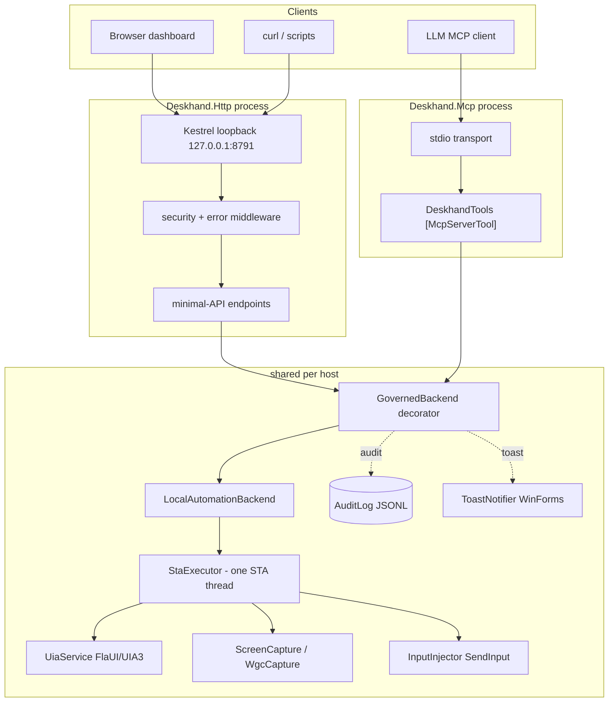

# 01 — Architecture

## Solution layout

```
Deskhand.slnx                         # XML solution (new .slnx format)
Deskhand.html                         # the original design document (phases, rationale)
Deskhand.http                         # ready-to-run sample HTTP requests
README.md
src/
  Deskhand.Core/                      # the backend library (no host)
    IAutomationBackend.cs             #   the single seam
    LocalAutomationBackend.cs         #   the in-session implementation
    StaExecutor.cs                    #   one dedicated STA thread for all COM/UIA
    Models.cs                         #   DTOs (records)
    Exceptions.cs                     #   typed exceptions
    DpiHelper.cs                      #   Per-Monitor-v2 opt-in
    Interop/NativeMethods.cs          #   all P/Invoke for Core
    Elements/ElementRegistry.cs       #   opaque ref -> element + re-resolution recipe
    Services/
      UiaService.cs                   #   FlaUI/UIA3 tree, patterns, properties
      ScreenCapture.cs                #   GDI + PrintWindow, dispatches to WGC
      WgcCapture.cs                   #   Windows.Graphics.Capture via Vortice D3D11
      SecureCapture.cs                #   input-desktop attach primitive (Phase 2)
      InputInjector.cs                #   SendInput mouse + keyboard
      DesktopInfo.cs                  #   machine/monitors/desktop-state
      WindowService.cs                #   foreground-lock defeat
    Governance/
      IAutomationBackend is wrapped by GovernedBackend.cs   # audit + gates + toast
      ControlState.cs                 #   armed / input / capture / notify switches
      AuditLog.cs                     #   JSONL audit trail
      KillSwitch.cs                   #   global hotkey Ctrl+Alt+Pause
      ICaptureNotifier.cs             #   toast interface (implemented by the host)
  Deskhand.Http/                      # ASP.NET Core minimal-API host (SDK.Web)
    Program.cs                        #   endpoints + security + error mapping
    wwwroot/index.html                #   single-file dashboard
  Deskhand.Mcp/                       # MCP stdio host
    Program.cs                        #   Generic Host + AddMcpServer
    DeskhandTools.cs                  #   [McpServerTool] methods
  Deskhand.Ui/                        # shared WinForms toast notifier
    ToastNotifier.cs
  Deskhand.SecureHelper/              # Phase 2: SYSTEM console-session capture exe
    Program.cs
  Deskhand.Broker/                    # Phase 2: elevated launcher (winlogon token)
    Program.cs
    Interop.cs
```

## The `IAutomationBackend` seam — why it exists

Every command in the system — HTTP endpoint, MCP tool, dashboard button — routes through one interface,
`Deskhand.Core.IAutomationBackend`. The hosts are **thin shells** that translate their transport (an HTTP
request body, an MCP tool call) into a call on this interface, and translate the result back. They contain
no automation logic.

Reasons:

1. **One place for governance.** The real backend (`LocalAutomationBackend`) is wrapped by a decorator,
   `GovernedBackend`, that both hosts construct identically. Kill switch, capability gates, audit logging,
   and the screenshot toast therefore apply to HTTP and MCP alike, with zero duplication.
2. **Future backends.** The design keeps remote open: a `FleetAgentBackend` (gRPC/mTLS) and an
   `RdpProtocolBackend` can implement the same interface. The RDP backend would advertise only the
   *transport-portable* subset (capture + input), because UIA needs code running *inside* the session.
   The interface comment marks UIA members as "agent-only" and capture/input as "transport-portable".
3. **One STA discipline.** `LocalAutomationBackend` funnels all UIA/COM work onto a single STA thread
   (see `03-core-backend.md`), so apartment rules are handled in exactly one place.

## Component / process model (this build)



Note: **the HTTP host and the MCP host are separate processes**, each with its *own* `GovernedBackend`
+ `LocalAutomationBackend` + STA thread + `ControlState` + `KillSwitch`. They do not share state at
runtime; they share *code*. Run whichever host you need (or both).

The **Secure Helper** and **Broker** (Phase 2) are separate console executables, not part of either host
process. See `11-secure-desktop.md`.

## Data flow of one tool call (e.g. "invoke a button")

Take the MCP tool `deskhand_invoke(reference)`:

1. The MCP client sends a `tools/call` over stdio. The ModelContextProtocol runtime deserializes it and
   invokes `DeskhandTools.Invoke(IAutomationBackend b, string reference)`. `b` is DI-injected and is the
   `GovernedBackend`.
2. `GovernedBackend.Invoke(reference)` runs `RequireInput("invoke")`: if `!Armed` it records
   `refused:disarmed` to the audit log and throws `DisarmedException`; if `!InputEnabled` it throws
   `CapabilityDisabledException`. Otherwise it calls the inner backend inside an `Audited(...)` wrapper
   that records `ok` or `error:<Type>`.
3. `LocalAutomationBackend.Invoke(reference)` marshals `() => _uia.Invoke(reference)` onto the single STA
   thread via `StaExecutor.Invoke`.
4. On the STA thread, `UiaService.Invoke(reference)` resolves the ref through `ElementRegistry` (re-resolving
   if the cached element went stale), gets the FlaUI `InvokePattern`, and calls `.Invoke()`. If the element
   doesn't support the pattern it throws `PatternNotSupportedException`.
5. The result (or exception) propagates back up. The MCP tool returns the string `"ok"`; the HTTP endpoint
   returns `{ "ok": true }`. Exceptions are mapped to HTTP status codes in the HTTP host's error middleware
   (see `07-http-server.md`); the MCP host surfaces them as tool errors.

For a **capture** call the flow is the same, except `GovernedBackend` additionally: gates on
`CaptureEnabled`, records a SHA-256 content hash of the image bytes, and fires the screenshot toast via
`ICaptureNotifier`. The HTTP host returns JSON+base64 (or raw bytes with `?raw=true`); the MCP host returns
an `ImageContentBlock` so the model sees the image directly.
