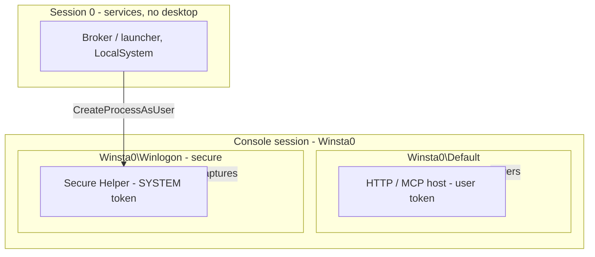

# 11 — Secure Desktop (Phase 2)

The HTTP/MCP hosts run in your **user session** and cover the **Default** desktop. The **secure desktop** —
where UAC prompts, the lock screen, and the logon UI live — can only be captured by a process running as
**SYSTEM inside the console session**. Phase 2 is three pieces: the `SecureCapture` primitive (in Core), the
`deskhand-secure` Secure Helper, and the `deskhand-broker` launcher.

## The Windows desktop model (why this is hard)

An interactive Windows session has one **window station**, `Winsta0`, containing several **desktop objects**.
Two matter:

- **`Winsta0\Default`** — the normal desktop, where user apps live.
- **`Winsta0\Winlogon`** — the **secure desktop**: UAC consent, lock screen, logon UI, Ctrl+Alt+Del.

Only one desktop is the **input desktop** at any instant; input flips to `Winlogon` on escalation/lock/logon.
Two rules force the whole layout:

1. A user-session process on `Default` **cannot see or touch** `Winlogon`. Reaching it needs a **SYSTEM**
   process in the **console session** that can open that desktop and set its thread to it.
2. Neither can run from an isolated **Session 0** service — since Vista, Session-0 services have no
   interactive desktop. A service can only *supervise and spawn*; the real work happens in processes it
   launches into the session.



## Reporting desktop state — `DesktopInfo.GetDesktopState`

Even the unprivileged host reports which desktop owns input:

```csharp
IntPtr h = OpenInputDesktop(0, false, DESKTOP_READOBJECTS);   // 0x0001
if (h == IntPtr.Zero)
    return new DesktopStateDto("secure", "", InputAvailable:false,
        "Input desktop is not accessible from this user session (secure desktop or locked)...");
string name = GetDesktopName(h);   // via GetUserObjectInformation(UOI_NAME=2), Unicode
// "Default" -> default(input ok) | "Winlogon" -> secure | "Screen-saver" -> screensaver | else unknown
```

If `OpenInputDesktop` fails, the secure desktop is almost certainly active, and it's reported honestly with
`InputAvailable = false`.

## `SecureCapture` — the input-desktop attach primitive

`Deskhand.Core.Services.SecureCapture.CaptureInputDesktop(format, jpegQuality)` returns an
`InputDesktopResult(bool Success, string DesktopName, string Kind, CaptureResultDto? Capture, string Note)`.
It attaches a throwaway thread to whichever desktop owns input and GDI-captures it. As a normal user this
captures `Winsta0\Default` (proving the mechanism); as SYSTEM in the console session it captures
`Winsta0\Winlogon`.

```csharp
public static InputDesktopResult CaptureInputDesktop(ImageFormat format, int jpegQuality)
{
    InputDesktopResult result = new(false, "", "unknown", null, "not run");
    var thread = new Thread(() => result = Run(format, jpegQuality)) {
        IsBackground = true, Name = "Deskhand-DesktopAttach" };   // NOTE: default apartment = MTA
    thread.Start(); thread.Join();
    return result;
}

private static InputDesktopResult Run(ImageFormat format, int jpegQuality)
{
    IntPtr hInput = OpenInputDesktop(0, false, DESKTOP_ATTACH_ACCESS);
    if (hInput == IntPtr.Zero) return new(false, "", "secure", null, "OpenInputDesktop failed (Win32 ...) ...");
    IntPtr original = GetThreadDesktop(GetCurrentThreadId());
    try {
        if (!SetThreadDesktop(hInput)) return new(false, "", "unknown", null, "SetThreadDesktop failed ...");
        string name = DesktopName(hInput);        // "Default"->default, "Winlogon"->secure, ...
        var v = DesktopInfo.VirtualScreen();
        var rect = new Rectangle(v.X, v.Y, v.Width, v.Height);
        // GDI CopyFromScreen into a 32bpp Bitmap, encode PNG/JPEG  (same as ScreenCapture)
        ...
        return new(true, name, kind, capture, kind == "secure" ? "Captured the secure desktop." : $"Captured input desktop '{name}'.");
    }
    finally { if (original != IntPtr.Zero) SetThreadDesktop(original); CloseDesktop(hInput); }
}
```

`DESKTOP_ATTACH_ACCESS` = `DESKTOP_READOBJECTS(0x1) | DESKTOP_CREATEWINDOW(0x2) | DESKTOP_WRITEOBJECTS(0x80)
| DESKTOP_ENUMERATE(0x40) | DESKTOP_SWITCHDESKTOP(0x100)` — enough to attach a thread and read via GDI.

> **Gotcha — the attach thread MUST be MTA; `SetThreadDesktop` fails ERROR_BUSY on an STA thread.** An STA
> thread creates a hidden OLE message window, and `SetThreadDesktop` refuses to move a thread that owns
> windows (Win32 `ERROR_BUSY`). A clean **MTA** thread with no windows can switch desktops freely. That is
> why this uses a *fresh* `Thread` (default MTA) and **not** the UIA STA thread. `LocalAutomationBackend`
> deliberately calls `SecureCapture` directly, bypassing `StaExecutor`, for exactly this reason. It also
> restores the original desktop in `finally` and captures on the same thread while attached.

Exposed at `POST /capture/input-desktop` and MCP `deskhand_capture_input_desktop`, and in the dashboard's
Secure-desktop panel. WGC/DXGI cannot capture the secure desktop — this GDI attach path is the only one that
works there.

## Secure Helper — `deskhand-secure` (`Deskhand.SecureHelper`)

A standalone console `Exe` that runs the primitive. It calls `DpiHelper.EnablePerMonitorV2()`, reports
`WindowsIdentity.GetCurrent()` (including `IsSystem`), then:

```
deskhand-secure capture <out.png> [--jpeg]
```

Run as a normal user it saves `Winsta0\Default` (proves the mechanism). Run **as SYSTEM in the console
session** it saves the secure desktop. To do that without the Broker:

```
psexec -s -i <consoleSessionId> deskhand-secure.exe capture C:\temp\secure.png
```

(`query session` shows the console session id.) To see secure content, trigger a UAC prompt or lock the
workstation while the SYSTEM helper runs.

## Broker — `deskhand-broker` (`Deskhand.Broker`)

The elevated launcher that starts the Secure Helper as SYSTEM by **borrowing winlogon's token**. Two files:
`Program.cs` (logic) and `Interop.cs` (P/Invoke). Usage (**run elevated**):

```
deskhand-broker <path-to-deskhand-secure.exe> capture C:\temp\secure.png
```

Flow:

1. Require Administrator (`WindowsPrincipal.IsInRole(Administrator)`), else fail.
2. `WTSGetActiveConsoleSessionId()` → the console session id.
3. `EnableSeDebug()` — enable `SeDebugPrivilege` (`OpenProcessToken` current process + `LookupPrivilegeValue`
   + `AdjustTokenPrivileges`).
4. Find `winlogon.exe` **in that session** (it runs as SYSTEM in every interactive session).
5. `OpenProcessToken(winlogon.Handle, TOKEN_DUPLICATE | TOKEN_QUERY | TOKEN_ASSIGN_PRIMARY, out srcTok)`.
6. `DuplicateTokenEx(srcTok, MAXIMUM_ALLOWED, IntPtr.Zero, SecurityImpersonation, TokenPrimary, out dupTok)`.
7. `CreateEnvironmentBlock(out env, dupTok, false)`.
8. `CreateProcessAsUser(dupTok, helper, cmd, …, CREATE_UNICODE_ENVIRONMENT | CREATE_NO_WINDOW, env,
   helperDir, ref si, out pi)` with `si.lpDesktop = @"Winsta0\Default"`.
9. Wait (`WaitForSingleObject(pi.hProcess, INFINITE)`), read `GetExitCodeProcess`, close handles, return the
   helper's exit code.

Interop constants: `TOKEN_DUPLICATE=0x2`, `TOKEN_QUERY=0x8`, `TOKEN_ASSIGN_PRIMARY=0x1`,
`TOKEN_ADJUST_PRIVILEGES=0x20`, `MAXIMUM_ALLOWED=0x02000000`, `SecurityImpersonation=2`, `TokenPrimary=1`,
`CREATE_UNICODE_ENVIRONMENT=0x400`, `CREATE_NO_WINDOW=0x08000000`, `SE_PRIVILEGE_ENABLED=0x2`,
`INFINITE=0xFFFFFFFF`. APIs from `kernel32` (`WTSGetActiveConsoleSessionId`, `WaitForSingleObject`,
`GetExitCodeProcess`, `CloseHandle`, `GetCurrentProcess`), `advapi32` (`OpenProcessToken`,
`LookupPrivilegeValue`, `AdjustTokenPrivileges`, `DuplicateTokenEx`, `CreateProcessAsUser`), and `userenv`
(`CreateEnvironmentBlock`, `DestroyEnvironmentBlock`).

## Tested vs. not (be honest)

- **Verified capturing the Default desktop:** the `SecureCapture` primitive, the Secure Helper, and
  `POST /capture/input-desktop`.
- **Not exercised in the build sandbox:** the Broker's SYSTEM-launch path — it needs real elevation +
  `SeDebugPrivilege`. Run it on a real elevated console.
- **Secure-desktop capture** (reading UAC/lock/logon pixels) works once the helper truly runs as SYSTEM in
  the console session.
- **Secure-desktop INPUT** (e.g. clicking the UAC button) is *not* enabled here. Windows hardens the consent
  UI against synthetic input; the supported path is a **signed `uiAccess="true"` accessibility binary** in a
  trusted location plus admin policy. Deskhand's reliable secure-desktop capability is **capture**, not
  input. Genuine logon automation should use a **Credential Provider** or autologon, not synthetic
  keystrokes at LogonUI.
