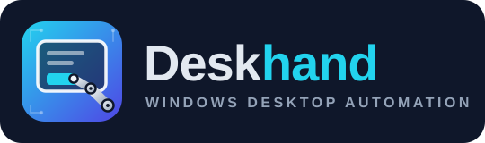

<p align="center">
  
</p>

# Deskhand — local HTTP automation server

A **localhost-only HTTP server** that exposes Windows **UI Automation**, **screen capture**, and
**synthetic input** for the machine it runs on. It is the HTTP surface of the Deskhand design
(see `Deskhand.html` for the full architecture doc). Built on **.NET 9 + FlaUI (UIA3)**.

This is the **Phase 1** deliverable: the single-machine, in-session **Default desktop** path.
The secure desktop (UAC / lock / logon) is *reported* by `/desktop/state` but driving it requires
the SYSTEM "Secure Helper" (Phase 2), which is not in this build.

## Layout

```
Deskhand.slnx
src/
  Deskhand.Core/          # backend: IAutomationBackend + LocalAutomationBackend
    Services/             #   UiaService (FlaUI), ScreenCapture (GDI), InputInjector (SendInput),
                          #   DesktopInfo, SecureCapture (input-desktop attach — Phase 2)
    Elements/             #   ElementRegistry — opaque refs + re-resolution recipe
    Interop/              #   P/Invoke (SendInput, PrintWindow, monitors, desktop attach, DPI)
    StaExecutor.cs        #   single STA thread that serializes all COM/UIA work
  Deskhand.Http/          # ASP.NET Core minimal API + web dashboard (wwwroot/index.html)
  Deskhand.Mcp/           # MCP server (stdio) — same IAutomationBackend, exposed as MCP tools
  Deskhand.SecureHelper/  # Phase 2: runs as SYSTEM in the console session to capture the secure desktop
  Deskhand.Broker/        # Phase 2: elevated launcher that starts the Secure Helper as SYSTEM
```

Both hosts — **HTTP** (`Deskhand.Http`) and **MCP** (`Deskhand.Mcp`) — are thin shells over the
same `IAutomationBackend`, so they expose identical capabilities.

The whole surface routes through `IAutomationBackend`, so a future gRPC **fleet-agent** backend or a
protocol-level **RDP** backend can implement the same contract without changing the HTTP layer.

## Build & run

```powershell
dotnet build Deskhand.slnx -c Release

# optional: pin a token and port (otherwise a random token is generated and printed)
$env:DESKHAND_TOKEN = "your-secret"
$env:DESKHAND_PORT  = "8791"          # default 8791

dotnet run --project src/Deskhand.Http -c Release
```

On start it prints the URL. **Just open it in a browser** — no token needed.

## Web dashboard

Open **http://127.0.0.1:8791** in any browser. The single-page console lets you:

- see live machine / desktop / monitor status (auto-refreshing);
- capture a monitor (or the whole virtual desktop) and click the screenshot to read desktop
  coordinates — or, in *control mode*, to move/click there for real;
- explore the UIA tree (foreground / focused / desktop root, lazy-expand), and per element
  **Invoke / Focus / Capture / Highlight** it on the screenshot;
- drive mouse and keyboard from the Input panel;
- watch an activity log of every request.

The dashboard talks to the API same-origin, so it needs no token.

## Security

No bearer token is required for the browser dashboard. The server is protected by:

- **Loopback by default** — Kestrel binds `127.0.0.1` / `::1`; no external interface is exposed
  unless you opt in with `DESKHAND_BIND` (see below).
- **Host check** — non-loopback `Host` headers are rejected (DNS-rebinding defense).
- **Cross-site block** — any request whose `Origin` isn't this server is rejected `403`, so other
  web pages in your browser cannot reach it. No CORS headers are emitted.
- **Optional token** — set `DESKHAND_TOKEN` to require `Authorization: Bearer <token>` from
  *non-browser* clients (curl / scripts). On loopback the same-origin dashboard still needs none.
- **Output can't be silently truncated** — every MCP tool result is bounded by a char budget
  (`DESKHAND_MAX_TOOL_CHARS`, default 200,000). If a result would exceed it, the full text is spilled to an
  OutputStore and the tool returns a small **valid** envelope (`{ truncated:true, outputId, url, head, note }`)
  instead of a giant blob the client would cut mid-token (which corrupts JSON/base64). Page the rest in-channel
  with `deskhand_read_output(outputId, offset, limit)` or download it from `/outputs/{id}`. (Screenshots use the
  separate `maxWidth`/`maxBytes` budget.) A client can pin the budget to **its own** context limit at runtime with
  `deskhand_output_budget(chars)` / `POST /config/output-budget` — no restart or env change needed.
- **Shell is opt-in** — the command runner (`/shell/run`, `deskhand_run_command`, the dashboard **Shell**
  tab) is **disabled unless you start the server with `DESKHAND_ENABLE_SHELL=1`**, and even then requires
  the kill switch to be *armed* and audits every command. Off by default because it runs arbitrary code as
  the current user.
- **Cross-session launch is opt-in** — `/process/launch-as` (`deskhand_launch_process_as`) launches a program
  into a specific TS **session**, on a specific window-station\\**desktop**, as a specific **user**. Off unless
  `DESKHAND_ENABLE_SESSION_LAUNCH=1`; also requires *armed* and is audited (never the password).
- **Firewall port admin is opt-in** — listing rules (`/firewall/rules`, `deskhand_firewall_rules`) is read-only,
  but opening/closing ports (`/firewall/open` · `/firewall/close`) is off unless
  `DESKHAND_ENABLE_FIREWALL_ADMIN=1`; also requires *armed*, is audited, and needs the host running as
  Administrator. **Deskhand only ever removes rules it opened** (see below).

#### Set-of-Mark: pick a number, not a pixel (`capture_* marks:true`, `deskhand_act_mark`)

Models ignore a coordinate list because it competes with the picture — so put the targets *on* the picture.
`deskhand_capture_screen/region/window` with **`marks:true`** draws numbered boxes over every actionable target
(UIA controls + OCR text) and returns a legend `{ markSet, marks:[{id,label,type,ref,x,y,actions}], total }`.
The model reads a **number off the image** and calls **`deskhand_act_mark(id)`** — Deskhand hits that target's
exact center or acts by its UIA ref (invoke/set_value/toggle/select), no pixel guessing. Dense UI? The legend
reports `total` when capped; narrow with **`markFilter:"save"`** or **`markOnly:"uia"`**, or mark a smaller
**region** — rather than drawing hundreds of unreadable boxes.

#### Explore the UX (`/ux/explore`, `deskhand_explore_ux`)

A compact, action-oriented **map** of the current window for an agent to navigate by — instead of a verbose UIA
tree or a screenshot it can't see. It **fuses two layers**: **UIA interactables** (buttons, menus, tabs, edits,
list items — each with a `ref`, a click-ready screen center, and its actions: `invoke`/`toggle`/`expand`/
`setValue`/`select`) and **OCR text targets** (every on-screen word as a click point at its center). The OCR
layer is what makes **UIA-blind UIs navigable** — custom-drawn apps, Chromium/Electron canvases, audio plugins,
games — where the UIA tree is thin or absent. Returns `{ window, uiaCount, textCount, targets[…], note }`, ranked
(enabled, reading order) and capped; act on a `uia` target by ref, or click any target's `(x,y)`.

#### Keyboard shortcuts, sequences, holds, and Ctrl+Alt+Del

- **`deskhand_send_keys`** — one chord: `ctrl+shift+s`, `alt+F4`, `enter`, `win+d`. Modifiers `ctrl`/`alt`/`shift`/`win`; keys are letters/digits/symbols, `F1`–`F24`, and named keys (enter, tab, esc, arrows, home/end, pageup/down, …).
- **`deskhand_press_keys`** — a *sequence* of chords, e.g. `["alt+f","s"]` to walk File→Save, with `betweenMs` pacing and `repeat`.
- **`deskhand_hold_key`** — press-and-hold a key/chord for `holdMs` (games, key-repeat).
- **`deskhand_secure_attention`** — **Ctrl+Alt+Del**. Plain injection can't forge the Secure Attention Sequence; this uses the `SendSAS` API, which works when Deskhand runs as **LocalSystem** *or* when the `SoftwareSASGeneration` policy allows apps. `deskhand_sas_status` tells you whether it'll work here; `deskhand_configure_sas` sets the policy (needs elevation). It raises the secure desktop — *clicking* its options still needs the SYSTEM secure-desktop path.
- **`deskhand_lock_workstation`** — Win+L (via `LockWorkStation`).

Keystrokes go to the focused window (pass `reference` to focus first); all require *armed* and are audited. Fleet parity for send/press/secure-attention/lock.

#### Dismiss dialogs (`/dismiss-modals`, `deskhand_dismiss_modals`)

Closing pop-ups is a routine tax of driving real apps. `deskhand_dismiss_modals` finds open dialogs/modals and
closes them **non-committally** — it clicks Cancel / Close / No / Don't-Save before it would ever click OK, and
**never Yes** unless `acceptYes:true`, so it won't confirm a destructive prompt; it falls back to closing the
window. Only dialog-like windows (owned pop-ups, the classic `#32770` class) are touched — never the main
window — and it runs a few passes to clear a stack. Collapses many turns into one. For focus-stealers that pop
*over* the app (update/sign-in/notification windows), pass **`titleContains`** to close any window by a title
substring; **`includePopups:true`** also closes menu/flyout/dropdown/tooltip-class windows.

#### Capture that carries the clickable targets (`withTargets`)

The dominant agent loop is *capture → look → click-by-text*. Pass **`withTargets:true`** to `deskhand_capture_*`
and the screenshot comes back with a compact list of **clickable text (OCR words + centers) and UIA controls
(ref + center + type)** derived from the *same* capture — one round-trip instead of two, for a few KB.

#### Crawl & cache the whole UX (`/ux/crawl`, `deskhand_crawl_ux`)

Learn "every command this app has" once, then recall it. `deskhand_crawl_ux` actively explores a window to a
`depth`, building a deep tree of its controls, and **caches the map per app** (exe · window-class · title) —
`useCache:true` returns the saved map instantly instead of re-crawling. **Safe by design:** it only performs
non-destructive, structure-revealing actions (expand collapsed menus/trees/groups, optionally select tabs),
**never invokes** buttons/commands, skips dangerous labels (delete/quit/format/…), and collapses expanded nodes
back. `deskhand_ux_cache` lists / fetches / deletes cached maps. (For a snapshot of just the *current* screen's
actionable surface, use `deskhand_explore_ux` above.)

#### Reliable automation: wait, then act (`/vision/wait-*`, `/vision/click-*`, `/vision/pixel`)

The lookups above become *reliable* when you can wait on them and act in one shot:
- **`wait_for_image` / `wait_for_text`** — poll until a template or OCR string appears (`absent:true` → until it
  disappears), with a timeout. The visual twin of `wait_for_element`.
- **`wait_stable`** — block until a screen region stops changing (`waitForChange:true` → until it starts). Kills
  `sleep`-based flakiness after a click or navigation.
- **`click_image` / `click_text`** — find and click in one call (optionally waiting first).
- **`get_pixel`** — the RGB of one pixel, for cheap state checks.

#### System control (`/input/paste`, `/process/control`, `/service/control`, `/env`, `/task`)

Turns the read-only inventory into control: **paste** text fast via the clipboard + Ctrl+V; **process** kill /
suspend / resume / reprioritize; **service** start / stop / restart; **environment variables** get/set at
process/user/machine scope; **scheduled task** run / end / enable / disable. All mutations require *armed* and are
audited; privileged ones surface a clean access error when not elevated.

**Guardrails against footguns.** Destructive actions — process `kill`/`suspend`, service `stop`/`restart` —
require an explicit **`confirm:true`** (otherwise you get `{ confirmationRequired:true }` and nothing happens),
so a stray call can't do damage. Deskhand **refuses to kill/suspend its own process** or **stop the service
hosting it** — absolutely, so automation can't cut its own legs off. OS-critical processes (winlogon, lsass,
csrss, …) are refused unless you also pass **`force:true`**. Every guard lives in the service layer, so it
protects the fleet path too.

#### UAC (`/uac`, `/uac/config`, `/uac/respond`, `deskhand_uac_*`)

When elevation prompts get in an agent's way:
- **`/uac`** reports whether UAC is on, the admin consent behavior, and whether prompts are *automatable* (on the
  normal desktop).
- **`/uac/config`** (needs elevation) sets `EnableLUA` on/off (reboot), moves prompts off the **secure desktop**
  (`promptOnSecureDesktop:false`) so they can be answered, or sets `adminBehavior` — where **`autoApprove:true`
  (behavior 0) makes admins elevate silently with no prompt at all**, the most reliable "accept everything".
- **`/uac/respond`** best-effort presses Yes/No on a live prompt — which only works when the prompt is on the
  normal desktop *and* Deskhand runs elevated (Windows isolates the secure desktop by design).

#### Observability & integration (`/metrics`, `/audit/recent`, `/webhooks`, `/fetch`, self-update banner)

Prometheus **`/metrics`** (scrape without a token on loopback); an **Audit** dashboard tab over `/audit/recent`;
outbound **webhooks** that POST UI events to registered URLs; **`/fetch`** to pull a URL onto the box; and a
dashboard **banner** when a newer release exists (from the startup update check). Run the server itself as a
Windows service with `installer/install-service.ps1` (Session-0 caveats noted in the script).

#### Find an image on screen (`/vision/find`, `deskhand_find_image`)

The visual complement to OCR: locate a small template image (an icon, button, cursor — passed as a base64 PNG)
inside a screenshot by grayscale **normalized cross-correlation**, then click/drag to the result. `target` is
`screen` (default), `region` (`x,y,width,height`), or `window` (`hwnd`/`reference`). Returns matches sorted
best-first, each with a `score` and a **screen-coordinate** box + `centerX,centerY`, plus a `best` shortcut.
(`explore_ux` includes open **menu/popup windows** by default — `includePopups` — since they're separate
top-level windows, which is the only structural path through a menu-driven app.)
Search is coarse-to-fine (a downscaled pass finds candidates, each refined at full resolution) — a full 2880×1920
screen scans in about a second — and overlapping hits are de-duplicated. NCC tolerates brightness/contrast
shifts but **not** scaling or rotation of the template. Requires capture enabled. Fleet parity:
`deskhand_agent_find_image`, `/agents/{id}/vision/find`.

#### Drag-and-drop (`/mouse/drag`, `deskhand_drag`)

A real press → move → release gesture in one atomic call: `{fromX, fromY, toX, toY, button?, steps?, holdMs?}`.
`steps` interpolates the motion for smoothness (default 20); `holdMs` dwells after the press and before the
release (default 60) for drop targets that need it. Fleet parity: `/agents/{id}/mouse/drag`, `deskhand_agent_drag`
(native agents; the RDP backend can't press-and-hold, so it returns a clear "not supported").

#### OpenAPI / Swagger

The whole HTTP surface is described by an OpenAPI document at `/swagger/v1/swagger.json`, with an interactive
**Swagger UI** at `/swagger`. On loopback the same-origin browser reaches it without a token.

#### Self-update (`/update/*`, `deskhand_update_*`)

`GET /update/check` compares the running version against the latest [GitHub release](https://github.com/guscatalano/Deskhand/releases)
and reports `{ current, latest, updateAvailable, notes, … }` — read-only. `POST /update/apply` downloads the
self-contained `deskhand.zip`, stages it, and hands off to a small detached updater that stops the server, copies
the new files over the install directory, and relaunches. It only works on a zip/self-contained install and runs
downloaded code, so it's **off unless `DESKHAND_ENABLE_SELF_UPDATE=1`**, requires *armed*, and is audited.

#### OCR — read text off the screen (`/ocr/*`, `deskhand_ocr_*`)

Windows' built-in OCR engine (`Windows.Media.Ocr` — no external dependency, no network) reads on-screen text for
apps UI Automation **can't** see: custom-drawn UIs, Chromium/Electron canvases, games, remote-desktop pixels.
Capture the screen / a region / a window, get back `{ text, words[{text,x,y,width,height}], wordCount, lineCount }`
— and every word box is in **screen coordinates**, so you can hand it straight to a mouse-move/click. Needs an OCR
language pack installed (most Windows installs have one). Fleet parity works on RDP agents too (it OCRs the remote
target's pixels).

#### Clipboard & window management

- **Clipboard** — `GET/POST /clipboard`, `deskhand_clipboard_get/set/clear`. Unicode text; runs on an STA thread
  with retry so a momentary lock doesn't fail the call. Gated on *armed* (the clipboard can hold secrets).
- **Windows** — `POST /window`, `deskhand_window`: `activate` (defeats the foreground lock), `minimize`,
  `maximize`, `restore`, `close`, `move`, `resize`, `bounds` — addressed by the `nativeWindowHandle` from
  `/windows`. Handle-based, so it works for any HWND. Gated on *armed*.

#### Firewall: show rules, open & close ports (`/firewall/*`)

- **List** — `GET /firewall/rules` enumerates the Windows Firewall (via the `HNetCfg.FwPolicy2` COM API). Filter by
  `direction` (in/out), `port`, `enabledOnly`, a name/grouping substring (`contains`), or `managedOnly`. Read-only.
- **Open a port** — `POST /firewall/open {port, protocol?(tcp), direction?(in), remoteAddresses?, name?}` adds an
  **Allow** rule. Every rule Deskhand creates is tagged (Grouping = `Deskhand (managed)`, name prefixed `Deskhand`),
  so it's identifiable and cleanly removable. `remoteAddresses` (e.g. `LocalSubnet`) scopes who may connect.
- **Close a port** — `POST /firewall/close {port, protocol?, direction?}` (or `{all:true}`) removes **only
  Deskhand-tagged rules** that match. It will **never** delete a rule Deskhand didn't create — ask it to close
  `3389` and it refuses, because your RDP rule isn't one of Deskhand's. The tag lives in the firewall itself, so
  it survives restarts.

Opening/closing needs Administrator; without it you get a clear `E_ACCESSDENIED` + "requires Administrator" hint,
never an opaque failure. The dashboard has a **Firewall** tab — a filterable rules table (Deskhand's own rules are
tagged and get a one-click **✕ close**) plus an **open-port** form. Fleet parity:
`GET/POST /agents/{id}/firewall/rules|open|close` and the `deskhand_agent_firewall_*` tools.

#### Launch into a session / desktop / user (`/process/launch-as`)

Consolidates the three axes over `CreateProcessAsUser`:

- **`sessionId`** — target Terminal-Services session. Omit for the active console session; list ids with
  `deskhand_list_sessions` / `GET /sessions`.
- **`desktop`** — `winsta\desktop`, default `winsta0\default`.
- **`as`** — user context:
  - `"session"` *(default)* — run as **whoever is interactively logged into that session** (`WTSQueryUserToken`).
    You don't need their password; the caller usually doesn't know it.
  - `"credentials"` — run as an explicit `user` / `domain` / `password` (`LogonUser`).
  - `"system"` — run as `NT AUTHORITY\SYSTEM` in that session.

**Privilege:** crossing a session boundary or changing user needs `SeTcbPrivilege` — in practice the host must
run as **LocalSystem** (e.g. via the Deskhand Fleet Launcher service, or a SYSTEM-hosted agent). When it isn't,
you get a crisp `ERROR_PRIVILEGE_NOT_HELD` (or `ERROR_LOGON_FAILURE`, …) with a `hint`, never an opaque failure.
The one case that needs no elevation is **same-session, same-user, different desktop** — that path uses a plain
`CreateProcess` with `STARTUPINFO.lpDesktop` and works from an ordinary user process.

### Opening the port to the network (`DESKHAND_BIND`)

The port is loopback-only until you set `DESKHAND_BIND` — so you expose it *sometimes*, on purpose:

```powershell
$env:DESKHAND_TOKEN = "a-strong-secret"   # MANDATORY when exposing — the server refuses to start without it
$env:DESKHAND_BIND  = "any"               # "any" / "0.0.0.0" = all interfaces, or a specific local IP
dotnet run --project src/Deskhand.Http -c Release
# reach it from another machine: http://<this-pc-ip>:8791/?token=a-strong-secret
```

When bound to a non-loopback address the rules tighten: a **token becomes mandatory for *every*
client, the browser dashboard included** (`Sec-Fetch-Site` can be forged off-loopback, so it grants
no free pass), the loopback `Host` check is lifted, and `/mcp` requires the token too. The dashboard
picks up the token from `?token=` on first load, stashes it in `sessionStorage`, and sends it as a
bearer header (also via `?token=` on the `/events` stream). `/health` stays open; the static
`index.html` is served without a token but is inert without one. (The **fleet** server has the same
switch: `DESKHAND_FLEET_BIND=any` with a mandatory `DESKHAND_FLEET_TOKEN`.)

### Optional HTTPS (`DESKHAND_TLS*`)

By default the port is plain HTTP, so an exposed token crosses the wire in cleartext. Turn on TLS:

```powershell
$env:DESKHAND_TLS = "self-signed"          # ephemeral cert (CN=machine; SAN localhost+hostname+IPs)
#   — or bring your own —
$env:DESKHAND_TLS_CERT     = "C:\certs\deskhand.pfx"
$env:DESKHAND_TLS_PASSWORD = "pfx-password"   # optional
```

With TLS on, the server speaks `https://` (and the banner/URLs switch scheme). A self-signed cert
triggers a browser trust warning — import it or use a CA-issued `.pfx` for a clean padlock. The
fleet server mirrors this with `DESKHAND_FLEET_TLS` / `DESKHAND_FLEET_TLS_CERT` /
`DESKHAND_FLEET_TLS_PASSWORD`. There's still no cert *management* (rotation, ACME) — for that, or to
terminate TLS centrally, front Deskhand with a reverse proxy (`caddy`, `nginx`) instead.
- **No stealth** — input is honest `SendInput`; there is no anti-detection behavior.
- Run **unelevated** to automate normal apps. Elevated / secure-desktop targets are refused with a
  clear error (UIPI / secure desktop), by design.

## Endpoints

All bodies and responses are JSON (camelCase). `reference` values (`el_…`) come from any read call.

| Method & path | Body | Purpose |
|---|---|---|
| `GET /health` | — | Liveness (no auth) |
| `GET /machine` | — | Machine, monitors, virtual screen, desktop state |
| `GET /desktop/state` | — | `default` / `secure` / `screensaver` + input availability |
| `GET /control` | — | Kill-switch / capability state + audit directory |
| `POST /control` | `{armed?, inputEnabled?, captureEnabled?}` | Arm/disarm; toggle input/capture |
| `GET /events` | — | SSE stream of live UIA events (focus, window-open) |
| `GET /events/poll` | `?since=N` | Buffered UIA events newer than id N |
| `GET /foreground` | — | Foreground window element |
| `GET /focused` | — | Focused element |
| `GET /windows` | — | All top-level windows (the reliable way to enter a specific app) |
| `POST /process/launch` | `{path, args?, workingDir?, waitForWindowMs?}` | Launch a program; returns its window if it appears |
| `POST /process/launch-as` | `{path, args?, workingDir?, sessionId?, desktop?, as?, user?, domain?, password?, noWindow?}` | Launch into a specific **session** / **desktop**, as a specific **user** (see below) |
| `GET /firewall/rules` | `?direction=&port=&enabledOnly=&contains=&managedOnly=&max=` | List Windows Firewall rules (read-only) |
| `POST /firewall/open` | `{port, protocol?, direction?, remoteAddresses?, name?}` | Open a port (adds a Deskhand-tagged Allow rule) |
| `POST /firewall/close` | `{port, protocol?, direction?}` or `{all:true}` | Close a port **Deskhand opened** (never touches other rules) |
| `GET /clipboard` · `POST /clipboard` | `{text}` | Read / set the clipboard text (armed) |
| `POST /window` | `{hwnd, action, x?, y?, width?, height?}` | activate·minimize·maximize·restore·close·move·resize·bounds a window (armed) |
| `POST /ocr/screen` · `/ocr/region` · `/ocr/window` | `{monitor?}` · `{x,y,width,height}` · `{hwnd?/reference?}` | **OCR** on-screen text; words come back with **screen-coordinate boxes** |
| `POST /mouse/drag` | `{fromX, fromY, toX, toY, button?, steps?, holdMs?}` | **Drag-and-drop** — press, smooth move, release (one atomic gesture) |
| `POST /vision/find` | `{templateBase64, target?, …, threshold?, maxResults?}` | **Find an image** on screen; matches carry **screen-coordinate centers** |
| `POST /vision/wait-image` · `/vision/wait-text` | `{…, timeoutMs?, absent?}` | Poll until a template / OCR string appears (or disappears) |
| `POST /vision/wait-stable` | `{…region, settleMs?, waitForChange?}` | Block until a region settles (or starts changing) |
| `POST /vision/click-image` · `/vision/click-text` | `{…, button?, count?, timeoutMs?}` | Find-then-click an image / OCR word in one call |
| `GET /vision/pixel` | `?x=&y=` | RGB of one screen pixel |
| `POST /input/paste` | `{text}` | Set clipboard + Ctrl+V (fast exact Unicode entry) |
| `POST /process/control` | `{pid, action, tree?, level?}` | kill · suspend · resume · priority |
| `POST /service/control` · `GET /service/state` | `{name, action}` | start · stop · restart a Windows service (WMI) |
| `GET /env` · `POST /env` | `{name, value?, scope?}` | Read/set env vars (process·user·machine) |
| `POST /task` | `{task, action}` | Scheduled task run · end · enable · disable |
| `GET /uac` · `POST /uac/config` · `POST /uac/respond` | see below | Read/configure UAC; answer a live consent prompt |
| `POST /fetch` | `{url, path?, maxBytes?}` | Download a URL to a file on the box |
| `GET /metrics` | — | Prometheus gauges (no token; loopback scrape) |
| `GET /audit/recent` | `?limit=` | Tail the audit log (also the dashboard **Audit** tab) |
| `GET/POST/DELETE /webhooks` | `{url}` | Register outbound sinks for UI events |
| `GET /update/status` | — | Cached update check (drives the dashboard banner) |
| `GET /update/check` · `POST /update/apply` | — | Check GitHub Releases / self-update to the latest (apply is opt-in) |
| `GET /swagger` · `/swagger/v1/swagger.json` | — | **OpenAPI** spec + interactive Swagger UI for this API |
| `POST /uia/tree` | `{rootRef?, depth?, maxChildren?}` | Element subtree |
| `POST /uia/find` | `{rootRef?, name?, automationId?, controlType?, className?, scope?, max?}` | Query elements |
| `POST /uia/wait` | `{…conditions, timeoutMs?}` | Poll until a matching element appears (or `404 wait_timeout`) |
| `GET /uia/element/{ref}` | — | Re-read one element |
| `GET /uia/element/{ref}/properties` | — | **Every** UIA property of an element (name → value) |
| `POST /uia/invoke` | `{reference}` | Invoke pattern (click a button, etc.) |
| `POST /uia/set-value` | `{reference, text}` | Set a value (text boxes) |
| `POST /uia/toggle` | `{reference}` | Toggle a checkbox/switch |
| `POST /uia/expand-collapse` | `{reference, expand}` | Expand/collapse a tree item |
| `POST /uia/select` | `{reference}` | Select a list/tab item |
| `POST /uia/set-focus` | `{reference}` | Focus an element |
| `POST /capture/screen` | `{monitor?, format?, quality?, maxWidth?, maxBytes?}` | Whole virtual desktop, or one monitor. **`maxWidth`** caps resolution; **`maxBytes`** caps the encoded payload (PNG auto-switches to JPEG + downscales to fit) — the response reports the `scale` so image pixels map back to screen coords |
| `POST /capture/region` | `{x, y, width, height, format?, quality?}` | Arbitrary rectangle |
| `POST /capture/window` | `{reference? \| hwnd?, format?, quality?}` | One window (PrintWindow) |
| `POST /capture/element` | `{reference, format?, quality?}` | One element's bounds |
| `POST /capture/input-desktop` | `{format?, quality?}` | **Phase 2** — the desktop currently owning input (secure desktop when run as SYSTEM) |
| `POST /mouse/move` | `{x, y}` | Move cursor (virtual-desktop pixels) |
| `POST /mouse/click` | `{button?, x?, y?, count?}` | Click (`left`/`right`/`middle`) |
| `POST /mouse/down` · `/mouse/up` | `{button?, x?, y?}` | Press / release |
| `POST /mouse/scroll` | `{dx, dy}` | Wheel notches (dy up+, dx right+) |
| `POST /keyboard/type` | `{text}` | Type a literal string (Unicode) |
| `POST /keyboard/keys` | `{chord}` | Chord, e.g. `"ctrl+shift+s"`, `"alt+F4"`, `"enter"` |

**Capture responses** default to JSON `{desktop, rect, monitor, dpiScale, format, imageBase64}`.
Add `?raw=true` (or send `Accept: image/png`) to get raw image bytes instead.

`format` is `png` (default) or `jpeg`; `quality` (1–100) applies to JPEG.

## Governance & safety (Phase 3)

Both hosts wrap the backend in a `GovernedBackend`, so a single seam enforces safety and records
history for HTTP and MCP alike:

- **Audit log** — every action (reads, input, capture, refusals) is written as a JSON line to
  `%LOCALAPPDATA%\Deskhand\audit\audit-YYYYMMDD.jsonl`, with timestamp, user, action, detail, and a
  content hash for captures.
- **Kill switch** — `Armed` is the master switch; disarmed, all input and capture are refused
  (`403 disarmed`) while read-only introspection still works. Toggle it from the dashboard, the
  `POST /control` endpoint, the MCP tools `deskhand_disarm` / `deskhand_arm`, or the global hotkey
  **Ctrl+Alt+Pause**.
- **Capability gates** — disable input or capture independently (dashboard switches, `/control`, or
  env at startup: `DESKHAND_DISABLE_INPUT`, `DESKHAND_DISABLE_CAPTURE`, `DESKHAND_START_DISARMED`).
- **Screenshot toast** — an on-screen toast pops up in the bottom-right corner **every time a
  screenshot is taken**, so the user always knows their screen was captured. On by default; toggle
  via the dashboard Safety panel, `POST /control {notifyOnCapture}`, or `DESKHAND_DISABLE_CAPTURE_TOAST`.

The dashboard shows armed state in the top bar and a **Safety** panel (Screen & Input tab) with the
switches and the audit-log path. The Explorer also has a **↻ Refresh** button that reloads the current
tree and keeps your selection, for when the app under inspection changes.

## MCP server

`Deskhand.Mcp` exposes the same capabilities as **MCP tools** over stdio (~47 tools:
`deskhand_list_windows`, `deskhand_list_processes`, `deskhand_get_tree`, `deskhand_get_all_properties`,
`deskhand_element_from_point`, `deskhand_invoke`, `deskhand_capture_window`,
`deskhand_mouse_click`, `deskhand_wait_for_process`, `deskhand_record_start`,
`deskhand_user_input_start`, `deskhand_dump_process`, `deskhand_registry_browse`, …). Screenshots are
returned as real MCP image content, so a model sees them directly.

**Observe, not just drive** (see `AI_Documentation/14-events-hooks-recording.md`):
- **Process list + tree** — `deskhand_list_processes` returns every process with the top-level windows
  it owns; each window ref expands straight into the UIA tree (process → windows → elements). The
  dashboard has a matching **Processes** tab.
- **Event feed & hooks** — `deskhand_get_events` streams `focus_changed`, `window_opened`,
  `process_started`, `process_exited`; `deskhand_wait_for_process` blocks for a launch/exit by name/pid
  (window-open blocking is `deskhand_wait_for_element`).
- **Screen recording** — `deskhand_record_start` records a monitor (or all) to an animated **GIF** or
  **MJPEG-AVI**, with fps/scale/quality and a hard `maxDurationMs` auto-stop. Files go to one dir
  (`%LOCALAPPDATA%\Deskhand\recordings`), are audited, and auto-delete after 24h.
- **User-input recording** — `deskhand_user_input_start` records the *user's* clicks (each annotated with
  the UIA element it hit), scrolls, and typed text via global hooks. Off by default; `captureText=false`
  for mouse-only (keystrokes may include passwords). While it runs, the user sees a **persistent
  always-on-top banner + toast**, so no one is observed silently.
- **Process list + full-memory dumps** — `deskhand_list_processes` (process → windows → UIA tree) and
  `deskhand_dump_process(pid)` writes a full-memory `.dmp` (MiniDumpWriteDump, like Task Manager's *Create
  dump file*) to `%LOCALAPPDATA%\Deskhand\dumps`, audited, auto-deleted after 24h, gated on the kill
  switch. Dashboard **Processes** tab has a **⤓ Full memory dump** button.
- **Registry browsing** — `deskhand_registry_browse(path)` lists a key's subkeys + values (read-only;
  HKLM/HKCU/HKCR/HKU/HKCC). Dashboard **Registry** tab with breadcrumb navigation.
- **Start Menu apps** — `deskhand_list_apps` lists the Start Menu shortcuts (launch one via
  `deskhand_launch_process` with its path).
- **Virtual desktops** — `deskhand_list_desktops` groups windows by the Windows virtual desktop they're
  on; `deskhand_move_window_to_desktop` moves a window to the current (or a given) desktop. (Documented
  `IVirtualDesktopManager` only — listing/switching/creating desktops needs undocumented per-build COM.)

All four observation capabilities are also **routed over the fleet** — drive any agent's events,
`wait_for_process`, screen recording (downloadable through the server), and user-input recording by
`agentId` (`deskhand_agent_*` tools / `/agents/{id}/…` endpoints). Recording a fleet PC's user shows the
consent banner on *that* PC.

`deskhand_element_from_point(x, y)` returns the deepest UIA element at a screen coordinate
(virtual-desktop pixels), resolved fresh via UIA `FromPoint` — no tree walk, no stored ref. This
is the **reliable "find element"** for apps whose UIA tree is thin or whose refs go stale
(Chromium/Electron): capture the app, pick a pixel on the target, and act on the element you get
back. The fleet mirror is `deskhand_agent_element_from_point`; the HTTP endpoints are
`POST /uia/element-from-point` and `POST /agents/{id}/uia/element-from-point`. Both dashboards
expose it as an **on-click → 🔍 pick element** mode on the screenshot.

```powershell
dotnet build src/Deskhand.Mcp -c Release
```

Register it with an MCP client (e.g. Claude Desktop / Claude Code) — `mcp.json`:

```json
{
  "mcpServers": {
    "deskhand": {
      "command": "C:\\Users\\crimson\\source\\repos\\uia_mcp\\src\\Deskhand.Mcp\\bin\\x64\\Release\\net9.0-windows10.0.19041.0\\deskhand-mcp.exe"
    }
  }
}
```

The MCP server runs in your user session and covers the Default desktop, exactly like the HTTP one.

### Two ways to run MCP

- **stdio** — the standalone `deskhand-mcp.exe`; your client launches it on demand. No port, no
  dashboard.
- **HTTP (unified)** — the **dashboard server also serves MCP** over Streamable HTTP at
  **`http://127.0.0.1:8791/mcp`**. Run `deskhand-http` once and you get the browser dashboard *and*
  the MCP endpoint in **one process sharing one backend** — so the dashboard shows and governs
  exactly what your MCP client does (same audit, events, kill switch, macros, screenshot toast).

For Claude Code: `claude mcp add --transport http deskhand http://127.0.0.1:8791/mcp` (keep
`deskhand-http` running). Clients that support HTTP MCP take a URL instead of a command
(`{ "type": "http", "url": "http://127.0.0.1:8791/mcp" }`).

### Configure your MCP client (stdio)

For the stdio server, point your client at `deskhand-mcp.exe`. The examples use the MSI path
`C:\Program Files\Deskhand\mcp\deskhand-mcp.exe` — swap in your build path if running from source.

Most clients share the **`mcpServers`** shape:

```json
{
  "mcpServers": {
    "deskhand": { "command": "C:\\Program Files\\Deskhand\\mcp\\deskhand-mcp.exe" }
  }
}
```

| Client | Where | Notes |
|---|---|---|
| **Claude Code** | `claude mcp add deskhand -s user "C:\Program Files\Deskhand\mcp\deskhand-mcp.exe"` | Or the `mcpServers` block in a project `.mcp.json`. Restart the session. |
| **Claude Desktop** | `%APPDATA%\Claude\claude_desktop_config.json` | `mcpServers` block above. Restart the app. |
| **Cursor** | `.cursor/mcp.json` (project) or `%USERPROFILE%\.cursor\mcp.json` (global) | `mcpServers` block above. |
| **Windsurf** | `%USERPROFILE%\.codeium\windsurf\mcp_config.json` | `mcpServers` block above. |
| **Cline** (VS Code) | MCP Servers panel → *Configure* → `cline_mcp_settings.json` | `mcpServers` block above (add `"args": []`). |
| **VS Code** (Copilot agent) | `.vscode/mcp.json` | Uses **`servers`** + **`type`**: `{ "servers": { "deskhand": { "type": "stdio", "command": "…deskhand-mcp.exe" } } }` |
| **Zed** | `settings.json` → `context_servers` | `{ "context_servers": { "deskhand": { "command": { "path": "…deskhand-mcp.exe", "args": [] } } } }` |
| **Continue** | `~/.continue/config.yaml` | `mcpServers:` list — `- name: deskhand` / `command: …deskhand-mcp.exe` |

**Try it without a client** with the MCP Inspector:

```powershell
npx @modelcontextprotocol/inspector "C:\Program Files\Deskhand\mcp\deskhand-mcp.exe"
```

**Safety when testing:** the tools drive your real desktop. It starts **armed**; safe first calls are
`deskhand_machine_info`, `deskhand_list_windows`, `deskhand_capture_screen`. Call `deskhand_disarm`
(or set `DESKHAND_DISABLE_INPUT=1`) for read-only, and **Ctrl+Alt+Pause** is the global kill switch.

## Phase 2 — secure desktop (UAC / lock / logon)

The HTTP server runs in your user session and covers the **Default** desktop. The **secure
desktop** (`Winsta0\Winlogon`) — where UAC prompts, the lock screen, and the logon UI live —
can only be captured by a process running as **SYSTEM inside the console session**. Three pieces
implement this:

1. **`SecureCapture`** (in Core) — the primitive: attach a throwaway thread to whichever desktop
   currently owns input (`OpenInputDesktop` + `SetThreadDesktop`) and GDI-capture it. As a normal
   user this captures Default; as SYSTEM it also captures the secure desktop (WGC/DXGI cannot).
   Exposed at `POST /capture/input-desktop` and in the dashboard's **Secure desktop** panel.
2. **`deskhand-secure`** (Secure Helper) — a standalone exe that runs the primitive:
   ```
   deskhand-secure capture C:\temp\shot.png
   ```
   Run as a normal user it saves the Default desktop (proves the mechanism). Run **as SYSTEM in
   the console session** it saves the secure desktop.
3. **`deskhand-broker`** (Broker) — the elevated launcher that starts the Secure Helper as SYSTEM
   by borrowing winlogon's token:
   ```
   deskhand-broker deskhand-secure.exe capture C:\temp\secure.png     (run elevated)
   ```

**To capture the secure desktop right now**, either run the Broker elevated (above), or use
Sysinternals PsExec: `psexec -s -i <consoleSessionId> deskhand-secure.exe capture C:\temp\secure.png`
(`query session` shows the id). To actually see secure content, trigger a UAC prompt or lock the
workstation while the SYSTEM helper runs.

> **Tested vs. not:** the capture primitive, the Secure Helper, and `/capture/input-desktop` were
> verified capturing the Default desktop. The Broker's SYSTEM-launch path needs elevation +
> `SeDebugPrivilege` and was **not exercised in the build sandbox** — run it on a real elevated
> console. Driving *input* on the secure desktop (clicking the UAC button) additionally requires a
> signed `uiAccess` binary and admin policy, and is not enabled here — capture is the reliable part.

## Record & playback

Deskhand can record what you do and replay it — **synchronized, not blind**. Recording captures
state-changing actions (mouse, keyboard, and UIA acts) at the governance seam. Playback is smart:

- **UIA action steps re-resolve (wait for) their target element** before acting — so "click Save"
  waits for the Save button to exist rather than firing at a stale ref or coordinate.
- **Explicit expectations** — insert "wait for element Y (up to a timeout)" steps between actions,
  giving *do X, expect Y, do Z*. Playback blocks until the expectation is met (or fails clearly).
- Only raw coordinate/keyboard input honors the recorded timing (scaled by `speed`, each gap capped).

UIA steps store a **re-resolvable selector** (name / automationId / controlType / className), so a
macro replays across sessions even though element refs are per-session.

HTTP: `POST /macro/start`, `POST /macro/stop` (returns the macro JSON), `GET /macro/status`,
`POST /macro/expect {…conditions, timeoutMs}` (while recording), `POST /macro/play {speed?, macro?}`.
MCP: `deskhand_macro_start/stop/status/expect/play`. Dashboard: a **Macro** panel (Screen & Input)
plus an **Expect (macro)** action on any Explorer element.

## Fleet (Phase 4)

`Deskhand.Fleet.Server` + `Deskhand.Fleet.Agent` extend the single-machine backend to many machines.
The **agent** dials *outbound* to the server over a WebSocket and serves commands against its local
desktop (no inbound port on the agent). The **server** keeps a registry of connected agents and
exposes the **full** automation surface routed to a selected agent — the server-side
`RemoteAgentBackend` implements the entire `IAutomationBackend`, so every capability (UIA read/act,
capture, input, launch) works remotely.

```powershell
$env:DESKHAND_FLEET_TOKEN="s3cret"                  # shared agent+client token (optional)
$env:DESKHAND_FLEET_BIND="any"                      # accept remote agents (default: loopback)
dotnet run --project src/Deskhand.Fleet.Server -c Release          # 8799
# on each target machine:
$env:DESKHAND_FLEET_TOKEN="s3cret"; $env:DESKHAND_FLEET_URL="ws://server:8799/agent/connect"
$env:DESKHAND_AGENT_ID="WKS-1"; dotnet run --project src/Deskhand.Fleet.Agent -c Release
```

Client API (bearer token when configured): `GET /agents`, then the same surface per agent —
`GET /agents/{id}/machine|foreground|windows`, `POST /agents/{id}/uia/tree|find|wait|invoke|set-value`,
`/capture/screen|region|window|element`, `/mouse/*`, `/keyboard/*`, `/process/launch`.

The fleet server also serves a **web dashboard** at `http://127.0.0.1:8799` — a live grid of every
connected PC (screenshot thumbnails, machine/desktop/monitor info); click a PC to open it, watch its
screen live, and drive it (click-to-click, keyboard). This is where you *see other machines* (the
single-machine dashboard on `:8791` only shows the local one). The two dashboards cross-link in the
top bar (**Fleet** ⇄ **This PC**).

**The fleet is exposed over MCP too**, at `http://127.0.0.1:8799/mcp` — fleet-aware tools so a model
can list your PCs and drive any of them by id: `deskhand_list_agents`, then `deskhand_agent_capture_screen`,
`deskhand_agent_get_tree`, `deskhand_agent_click`, `deskhand_agent_type`, `deskhand_agent_invoke`,
`deskhand_agent_launch`, etc. Register it alongside the local one:

```powershell
claude mcp add --transport http deskhand-fleet http://127.0.0.1:8799/mcp
```

So a model gets both surfaces: `deskhand_*` for the local PC (`:8791/mcp`) and `deskhand_list_agents`
+ `deskhand_agent_*` for the whole fleet (`:8799/mcp`).

**Audit & consent.** Every agent connect/disconnect and every routed action — from the dashboard,
the HTTP API, *or* MCP — is recorded with the caller's address to a **durable append-only JSONL file**
(`%LOCALAPPDATA%\Deskhand\fleet-audit\fleet-YYYYMMDD.jsonl`), flushed per line so it survives a crash
and can be read afterward. View it live in the fleet dashboard's **Audit** drawer, or via the
`deskhand_fleet_audit` MCP tool. And whenever the fleet captures or controls a PC, that machine's
agent pops an on-screen **toast**, so the person there knows they're being watched.

**Done & tested:** outbound WebSocket transport, agent registry + routing, the full remote backend,
**shared-token auth** for agents and clients, and AnyIP binding — verified: no-token → 401,
authenticated agent routing across the whole surface.

**`Deskhand.Fleet.Launcher`** is a Windows Service (LocalSystem) that keeps an agent running in the
active console session, launched as the logged-in user via `WTSQueryUserToken` + `CreateProcessAsUser`:

```powershell
sc create DeskhandLauncher binPath= "C:\path\deskhand-launcher.exe" start= auto obj= LocalSystem
sc start DeskhandLauncher      # configure via machine env: DESKHAND_FLEET_URL / _TOKEN / DESKHAND_AGENT_EXE
```

The Launcher mechanism is **verified**: run as SYSTEM (e.g. `PsExec64 -s -d deskhand-launcher.exe`
with `DESKHAND_AGENT_EXE` / `DESKHAND_FLEET_URL` as machine env), it spawned the agent into the
interactive console session **as the logged-in user** (session 1, non-elevated), which then connected
to the fleet server and served routed calls.

> **Remaining hardening:** put **TLS** in front (reverse proxy or Kestrel HTTPS) for `wss://`, and
> optionally mTLS client certs instead of the shared token.

## RDP (Phase 5)

There are two ways Deskhand reaches a **Remote Desktop** machine:

1. **Agent in the RDP session (done, tested).** An RDP session is just another interactive session,
   so an agent running inside it has the **full** capability — UIA, capture, and input. The Launcher
   now enumerates **every active session** (`WTSEnumerateSessions`) — console *and* RDP — and spawns a
   per-session agent (`<machine>-S<sessionId>`), each connecting to the fleet server independently.
   Verified: run as SYSTEM, it discovered the session and registered `PORTARE-S1`; on a host with RDP
   sessions you get `…-S2`, `…-S3`, etc., side by side.

2. **Protocol-level, zero-install (`Deskhand.Rdp`, built).** A client that speaks the RDP wire
   protocol to a host with **nothing installed on the target** — capture + input only, **no UIA**
   (nothing runs in the session to read the tree). It hosts the **Microsoft RDP ActiveX control**
   (`mstscax.dll`) headlessly on an STA thread, connects with NLA credentials, captures the remote
   desktop with `PrintWindow`, and posts mouse/keyboard to the control's render window. `RdpBackend`
   implements the shared `IAutomationBackend` (capture + input; UIA members throw). CLI:

   ```powershell
   deskhand-rdp <host> <user> <password> [--domain D] [--size 1280x800] [--capture out.png]
   ```

   The ActiveX interop (`src/Deskhand.Rdp/lib/*.dll`) is generated once from `C:\Windows\System32\mstscax.dll`:
   `AxImp.exe mstscax.dll` (NETFX 4.8 Tools). **Verified:** the control hosts, the connect pipeline
   fires, and capture returns a valid PNG. Input (posted to the render window) and a live connected
   session need a reachable RDP host to validate — self-RDP to localhost would hijack the console.

Model 1 gives full fidelity (UIA + capture + input) with an agent the Launcher places in each session;
model 2 gives agentless reach when you can't install anything on the target.

## Recreation docs

`AI_Documentation/` contains a full, exact rebuild guide (architecture, dependencies with versions,
per-subsystem deep-dives, gotchas, and an ordered walkthrough) — enough for a human or an AI agent
to recreate Deskhand from scratch.

## Notes & limits

- **Coordinates** are physical pixels on the virtual desktop; the process is Per-Monitor-v2 DPI aware.
- **Element refs** are volatile UIA handles; a stale ref is re-resolved from a stored selector recipe,
  and returns `404 stale_element` if it truly cannot be found — re-query the tree.
- **Chromium/Electron** apps expose thin/unstable UIA trees. Two mitigations, both built in:
  - **Auto-flag on launch** — `LaunchProcess` (all hosts) appends `--force-renderer-accessibility`
    automatically when the target is a known Chromium browser (chrome, msedge, brave, opera, vivaldi,
    chromium, thorium), so its web contents show up in the tree. Force it on for *any* executable
    (Electron apps, whose exe names vary) with `DESKHAND_FORCE_A11Y=always`, or disable entirely with
    `DESKHAND_FORCE_A11Y=off`. Note: Chromium is single-instance per profile — the flag only takes
    hold on a **fresh** instance (a new `--user-data-dir`, or the browser not already running).
  - **Point-based access** — `deskhand_element_from_point(x, y)` resolves the element under a pixel
    with no tree walk and no stored ref, so it works even when the tree is thin. Capture + coordinate
    input remains the last-resort fallback (the model reads the screenshot and clicks by pixel).
  - **Deep-tree safety** — `get_tree` is bounded to 4000 nodes per call, so a huge Chromium a11y tree
    comes back partial rather than exhausting the walk.
- **Window capture** (`/capture/window`, `deskhand_capture_window`) uses **Windows.Graphics.Capture**,
  which faithfully captures GPU/DWM-accelerated apps (Chrome, Firefox, Electron) even when the window
  is **unfocused or occluded — without raising it**. It falls back to `PrintWindow` when WGC is
  unavailable (pre-1903). Screen/region/element capture use GDI `CopyFromScreen`.

See `Deskhand.http` for ready-to-run sample requests.
